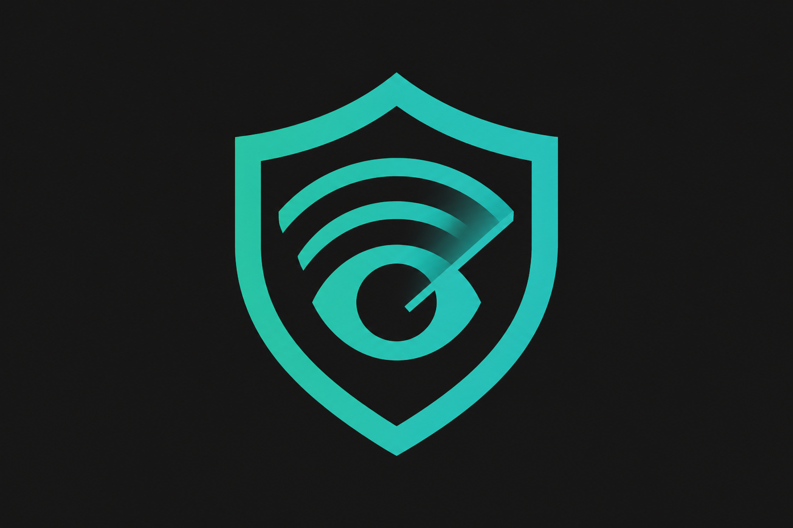

<div align="center">



<br/>

**Sentinel** is a self-hosted AI code review agent that connects to GitHub via OAuth, fetches pull request diffs, and runs structured analysis using **Llama 3.3 70B on Groq** — surfacing bugs, security vulnerabilities, performance bottlenecks, and code smells in seconds.

<br/>

[](.github/workflows/ci.yml)
[](.github/workflows/deploy.yml)


</div>

---

## Overview

Modern engineering teams review hundreds of pull requests each week. Human reviewers are inconsistent and slow — especially for cross-cutting concerns like security, performance, and code hygiene. Static analysis tools generate noise without context. AI review tools charge per seat at enterprise prices.

**Sentinel takes a different approach.** A developer opens a PR. Sentinel fetches the diff, passes it to a 70B LLM with a structured prompt, and posts an actionable review directly on GitHub — with severity levels, file locations, line numbers, and concrete fix suggestions. A Discord notification lands in the team channel simultaneously.

**Engineering philosophy:**
- **Occam's Razor** — The simplest architecture that solves the real problem. Sentinel avoids distributed queues and microservices until load demands it.
- **Automation-first** — Zero friction from commit to review. The system does the work; developers stay in flow.
- **ChatOps as a first-class citizen** — Reviews surface in Discord where the team already communicates.
- **Structured AI output** — The model returns typed JSON (`severity`, `category`, `file`, `line`, `message`, `suggestion`), making results machine-parseable without prompt fragility.

---

## Key Features

| Feature | Description | Status |
|---|---|---|
| **GitHub OAuth** | Full OAuth 2.0 flow — connect any repo with `repo` + `read:user` scopes | ✅ Live |
| **AI PR Analysis** | Llama 3.3 70B via Groq analyzes unified diffs for bugs, security, performance, code smells | ✅ Live |
| **Structured Review Output** | JSON schema: `severity`, `category`, `file`, `line`, `message`, `description`, `suggestion` | ✅ Live |
| **Quality Score** | 0–100 code quality score with visual progress bar | ✅ Live |
| **GitHub Comment Posting** | Auto-posts formatted Markdown review comment directly on the PR | ✅ Live |
| **Discord ChatOps** | Rich embed notifications with score, severity breakdown, and PR link | ✅ Live |
| **Language Detection** | Detects 15+ languages from file extensions, scopes AI analysis accordingly | ✅ Live |
| **Async Background Reviews** | Reviews run via Node event loop/promises — non-blocking, returns 202 immediately | ✅ Live |
| **Configurable Analysis** | Per-user toggles: security, performance, code smell checks, auto-post to GitHub | ✅ Live |
| **Dynamic CI Linting** | GitHub Actions detects changed file types and runs language-specific linters | ✅ Live |
| **Auto-Deploy Pipeline** | Push-to-main triggers Vercel (frontend) + Render (backend) deploys | ✅ Live |
| **Slack / Teams Integration** | Parallel notification channel support | 🔜 Planned |
| **Webhook Auto-Trigger** | Trigger reviews from GitHub Actions on PR open | 🔜 Planned |

---

## System Architecture

Sentinel uses a decoupled MERN architecture: a Next.js frontend, an Express backend running on Node.js with structured API routers, and an AI engine powered by Groq. All GitHub communications flow asynchronously through an Axios-based GitHub Service layer. Triggered reviews return an immediate `202` response, handling processing completely out-of-band.

```mermaid
graph LR
    subgraph Client["🖥 Client"]
        UI["Next.js 16\nshadcn/ui + Tailwind"]
    end

    subgraph API["⚡ Node.js & Express Backend"]
        AUTH["/api/auth/*\nOAuth + JWT"]
        GH["/api/github/*\nRepo + PR listing"]
        REV["/api/reviews/*\nTrigger + History"]
        USR["/api/users/*\nSettings"]
    end

    subgraph AI["🤖 AI Engine"]
        AREV["aiReviewer.js\nPrompt Builder + Parser"]
        GROQ["Groq SDK\nLlama 3.3 70B"]
    end

    subgraph Ext["🌐 External"]
        GHA["GitHub API\nOAuth + REST v3"]
        DISC["Discord\nWebhook API"]
    end

    DB[("MongoDB\nMongoose")]

    UI -->|"REST + JWT Bearer"| API
    AUTH -->|"Code Exchange"| GHA
    GH -->|"List Repos / PRs"| GHA
    REV -->|"Fetch Diff + Files"| GHA
    REV -->|"Post Comment"| GHA
    REV -->|"Async Execution"| AREV
    AREV -->|"Structured Prompt"| GROQ
    GROQ -->|"JSON Response"| AREV
    REV -->|"Rich Embed"| DISC
    API <-->|"Mongoose ODM"| DB
